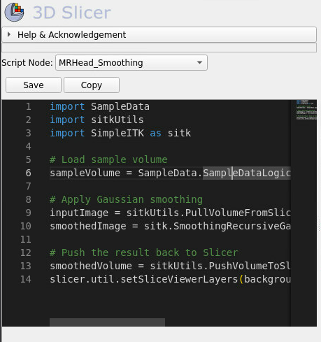
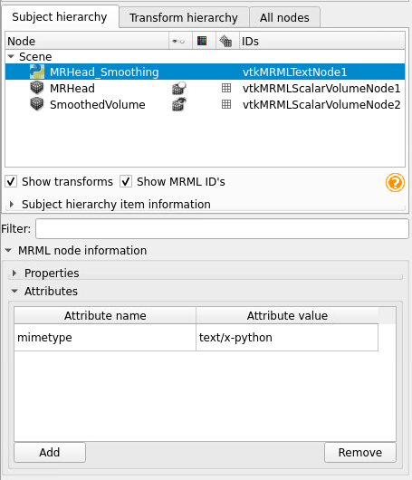

# SlicerEditor
a simple programming editor for Slicer based on [monaco editor](https://microsoft.github.io/monaco-editor/)


 


## Description

The SlicerEditor extension provides the open-source Monaco editor as a module inside the Slicer. It supports auto-completion, and syntax highlighting and allows the scripts to be directly sent to the 3D Slicer's built-in Python console.

## Module Descriptions

- **SlicerEditor**: Editor Module itself.
- **PyFile**: Subject hierarchy plugin to create and manage text nodes from imported .py files.
- **SavePyFile**: Subject hierarchy plugin to export vtkMRMLTextNode nodes with text/x-python mimetype as .py files.

## Typical Use Case

The most typical use case for SlicerEditor is to develop, debug, and execute Python scripts directly within the 3D Slicer environment. This allows users to automate tasks, create custom analyses, and enhance the functionality of 3D Slicer through scripting.

## Step-by-Step Tutorial

### Step 1: Install SlicerEditor Extension
1. Open 3D Slicer.
2. Go to the "Extension Manager" by clicking on the "View" menu and selecting "Extension Manager".
3. Search for "SlicerEditor".
4. Click "Install" next to the SlicerEditor extension.
5. Restart 3D Slicer to activate the extension.

### Step 2: Open SlicerEditor Module
1. After restarting, go to the "Modules" menu.
2. Select "SlicerEditor" from the list of installed modules.

### Step 3: Create or Select a Python Text Node
1. In the SlicerEditor module, you will see a combo box labeled "Script Node".
2. You can create a new Python text node by selecting "(Create New Python Text Node)" from the combo box.
3. Alternatively, you can select an existing Python text node if you have previously created one.

### Step 4: Writing Python Code
1. Once a text node is selected, the Monaco Editor will be enabled.
2. Write your Python script in the editor. This script can interact with the 3D Slicer API to manipulate data, perform analyses, or automate tasks.

### Step 5: Saving Your Script
1. After writing your script, you can save it by clicking the "Save" button.
2. The script will be saved in the selected text node.

### Step 6: Running Your Script
1. To execute your script, ensure it is selected in the text node combo box.
2. Click the "Run" button (if implemented), or use the Slicer Python Interactor to execute the script manually by copying and pasting the code.

### Step 7: Copying Your Script
1. You can copy the code from the editor to the clipboard by clicking the "Copy" button.
2. This is useful if you want to run the script in the Slicer Python Interactor or share it with others.

## Example Script

Here's an example script that can be used to load a sample volume and apply a Gaussian smoothing filter:

```python
import SampleData
import sitkUtils
import SimpleITK as sitk

# Load sample volume
sampleVolume = SampleData.SampleDataLogic().downloadMRHead()

# Apply Gaussian smoothing
inputImage = sitkUtils.PullVolumeFromSlicer(sampleVolume)
smoothedImage = sitk.SmoothingRecursiveGaussian(inputImage, sigma=2.0)

# Push the result back to Slicer
smoothedVolume = sitkUtils.PushVolumeToSlicer(smoothedImage, name='SmoothedVolume')
slicer.util.setSliceViewerLayers(background=smoothedVolume)
```

## Additional Tips

- **Debugging**: Use `print` statements to output information to the Slicer Python Interactor for debugging purposes.
- **Node Management**: Utilize the Slicer module widgets to manage nodes and visualize results effectively.
- **Resources**: Refer to the [3D Slicer Script Repository](https://slicer.readthedocs.io/en/latest/developer_guide/script_repository.html) for more script examples and API documentation.
